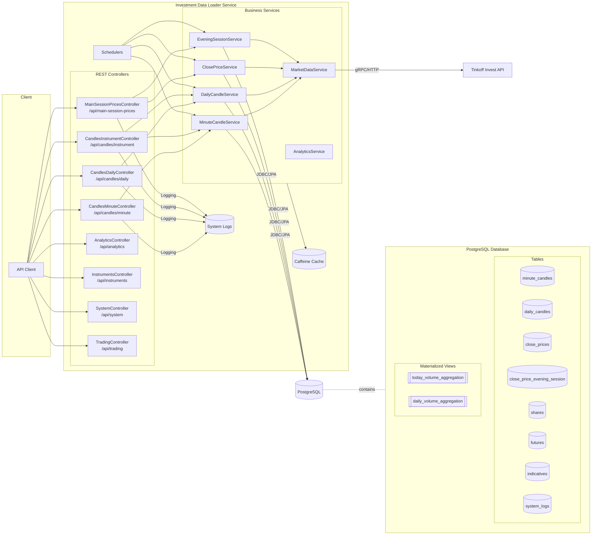
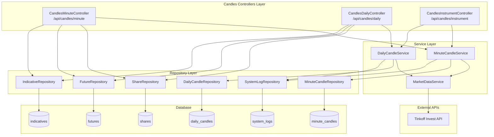
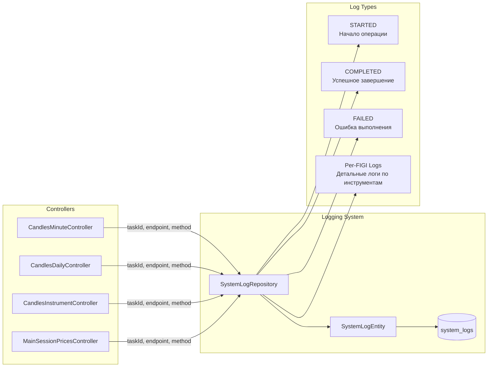
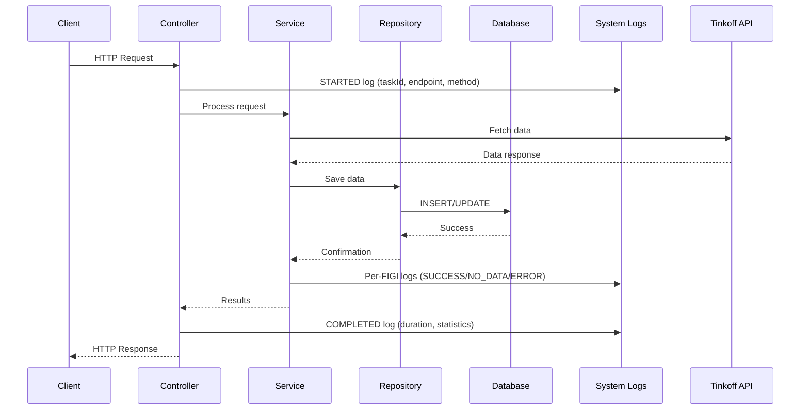
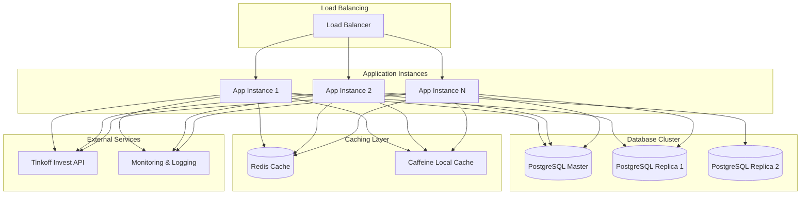

# Архитектура (высокоуровневая)

```mermaid
flowchart LR
  subgraph Client
    Postman[API Client]
  end

  subgraph Service[Investment Data Loader Service]
    subgraph Controllers[REST Controllers]
      MSPC[MainSessionPricesController<br/>/api/main-session-prices]
      CM[CandlesMinuteController<br/>/api/candles/minute]
      CD[CandlesDailyController<br/>/api/candles/daily]
      CI[CandlesInstrumentController<br/>/api/candles/instrument]
      AC[AnalyticsController<br/>/api/analytics]
      IC[InstrumentsController<br/>/api/instruments]
      SC[SystemController<br/>/api/system]
      TC[TradingController<br/>/api/trading]
    end
    
    subgraph Services[Business Services]
      MCS[MinuteCandleService]
      DCS[DailyCandleService]
      MDS[MarketDataService]
      CPS[ClosePriceService]
      ESS[EveningSessionService]
      AS[AnalyticsService]
    end
    
    Scheduler[Schedulers]
    Cache[(Caffeine Cache)]
    Logs[(System Logs)]
  end

  Postman --> MSPC
  Postman --> CM
  Postman --> CD
  Postman --> CI
  Postman --> AC
  Postman --> IC
  Postman --> SC
  Postman --> TC
  
  MSPC --> CPS
  MSPC --> ESS
  CM --> MCS
  CD --> DCS
  CI --> MCS
  CI --> DCS
  MCS --> MDS
  DCS --> MDS
  CPS --> MDS
  ESS --> MDS
  
  Scheduler --> MCS
  Scheduler --> DCS
  Scheduler --> CPS
  Scheduler --> ESS
  
  MCS -->|JDBC/JPA| DB[(PostgreSQL)]
  DCS -->|JDBC/JPA| DB
  CPS -->|JDBC/JPA| DB
  ESS -->|JDBC/JPA| DB
  MDS -->|gRPC/HTTP| Tinkoff[Tinkoff Invest API]
  
  CM -->|Logging| Logs
  CD -->|Logging| Logs
  CI -->|Logging| Logs
  MSPC -->|Logging| Logs
  
  Services --> Cache

  subgraph DBDetails[PostgreSQL Database]
    subgraph Tables[Tables]
      MC[(minute_candles)]
      DC[(daily_candles)]
      CP[(close_prices)]
      CPES[(close_price_evening_session)]
      S[(shares)]
      F[(futures)]
      I[(indicatives)]
      SL[(system_logs)]
    end
    
    subgraph Views[Materialized Views]
      MvToday[[today_volume_aggregation]]
      MvDaily[[daily_volume_aggregation]]
    end
  end

  DB -. contains .- DBDetails
```

## Детальная архитектура контроллеров свечей

```mermaid
graph TB
    subgraph "Candles Controllers Layer"
        CM[CandlesMinuteController<br/>/api/candles/minute]
        CD[CandlesDailyController<br/>/api/candles/daily]
        CI[CandlesInstrumentController<br/>/api/candles/instrument]
    end
    
    subgraph "Service Layer"
        MCS[MinuteCandleService]
        DCS[DailyCandleService]
        MDS[MarketDataService]
    end
    
    subgraph "Repository Layer"
        MCR[MinuteCandleRepository]
        DCR[DailyCandleRepository]
        SR[ShareRepository]
        FR[FutureRepository]
        IR[IndicativeRepository]
        SLR[SystemLogRepository]
    end
    
    subgraph "External APIs"
        TAPI[Tinkoff Invest API]
    end
    
    subgraph "Database"
        MC_TBL[(minute_candles)]
        DC_TBL[(daily_candles)]
        S_TBL[(shares)]
        F_TBL[(futures)]
        I_TBL[(indicatives)]
        SL_TBL[(system_logs)]
    end
    
    CM --> MCS
    CD --> DCS
    CI --> MCS
    CI --> DCS
    
    MCS --> MDS
    DCS --> MDS
    MCS --> MCR
    DCS --> DCR
    MCS --> SLR
    DCS --> SLR
    
    CM --> SR
    CM --> FR
    CM --> IR
    CD --> SR
    CD --> FR
    CD --> IR
    
    MDS --> TAPI
    MCR --> MC_TBL
    DCR --> DC_TBL
    SR --> S_TBL
    FR --> F_TBL
    IR --> I_TBL
    SLR --> SL_TBL
```

## Система логирования

```mermaid
graph LR
    subgraph "Controllers"
        CM[CandlesMinuteController]
        CD[CandlesDailyController]
        CI[CandlesInstrumentController]
        MSPC[MainSessionPricesController]
    end
    
    subgraph "Logging System"
        SLR[SystemLogRepository]
        SLE[SystemLogEntity]
        SL_TBL[(system_logs)]
    end
    
    subgraph "Log Types"
        START[STARTED<br/>Начало операции]
        COMP[COMPLETED<br/>Успешное завершение]
        FAIL[FAILED<br/>Ошибка выполнения]
        FIGI[Per-FIGI Logs<br/>Детальные логи по инструментам]
    end
    
    CM -->|taskId, endpoint, method| SLR
    CD -->|taskId, endpoint, method| SLR
    CI -->|taskId, endpoint, method| SLR
    MSPC -->|taskId, endpoint, method| SLR
    
    SLR --> SLE
    SLE --> SL_TBL
    
    SLR --> START
    SLR --> COMP
    SLR --> FAIL
    SLR --> FIGI
```

## Поток данных и логирования

```mermaid
sequenceDiagram
    participant C as Client
    participant Ctrl as Controller
    participant Svc as Service
    participant Repo as Repository
    participant DB as Database
    participant Logs as System Logs
    participant API as Tinkoff API

    C->>Ctrl: HTTP Request
    Ctrl->>Logs: STARTED log (taskId, endpoint, method)
    
    Ctrl->>Svc: Process request
    Svc->>API: Fetch data
    API-->>Svc: Data response
    
    Svc->>Repo: Save data
    Repo->>DB: INSERT/UPDATE
    DB-->>Repo: Success
    Repo-->>Svc: Confirmation
    
    Svc->>Logs: Per-FIGI logs (SUCCESS/NO_DATA/ERROR)
    Svc-->>Ctrl: Results
    
    Ctrl->>Logs: COMPLETED log (duration, statistics)
    Ctrl-->>C: HTTP Response
```

## Масштабируемость и производительность

```mermaid
graph TB
    subgraph "Load Balancing"
        LB[Load Balancer]
    end
    
    subgraph "Application Instances"
        APP1[App Instance 1]
        APP2[App Instance 2]
        APP3[App Instance N]
    end
    
    subgraph "Database Cluster"
        MASTER[(PostgreSQL Master)]
        REPLICA1[(PostgreSQL Replica 1)]
        REPLICA2[(PostgreSQL Replica 2)]
    end
    
    subgraph "Caching Layer"
        REDIS[(Redis Cache)]
        CAFFEINE[Caffeine Local Cache]
    end
    
    subgraph "External Services"
        TINKOFF[Tinkoff Invest API]
        MONITORING[Monitoring & Logging]
    end
    
    LB --> APP1
    LB --> APP2
    LB --> APP3
    
    APP1 --> MASTER
    APP1 --> REPLICA1
    APP2 --> MASTER
    APP2 --> REPLICA2
    APP3 --> MASTER
    APP3 --> REPLICA1
    
    APP1 --> REDIS
    APP2 --> REDIS
    APP3 --> REDIS
    
    APP1 --> CAFFEINE
    APP2 --> CAFFEINE
    APP3 --> CAFFEINE
    
    APP1 --> TINKOFF
    APP2 --> TINKOFF
    APP3 --> TINKOFF
    
    APP1 --> MONITORING
    APP2 --> MONITORING
    APP3 --> MONITORING
```