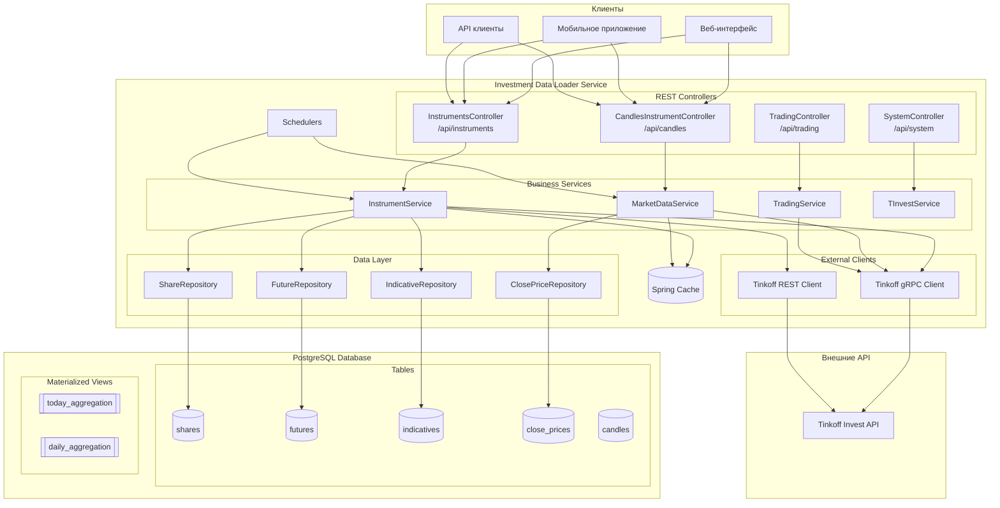
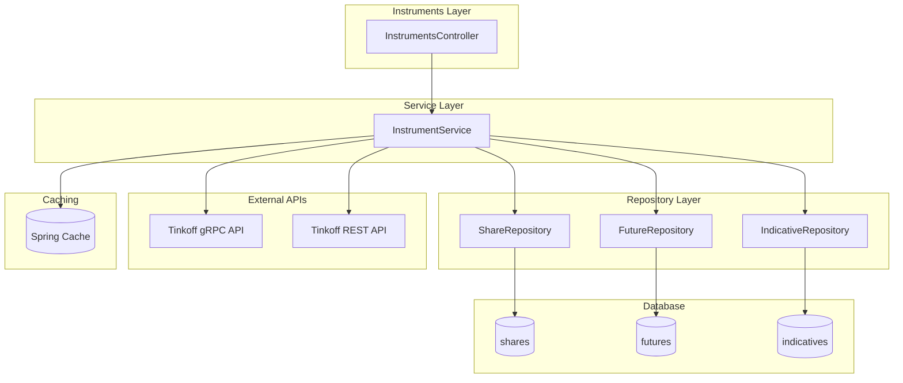
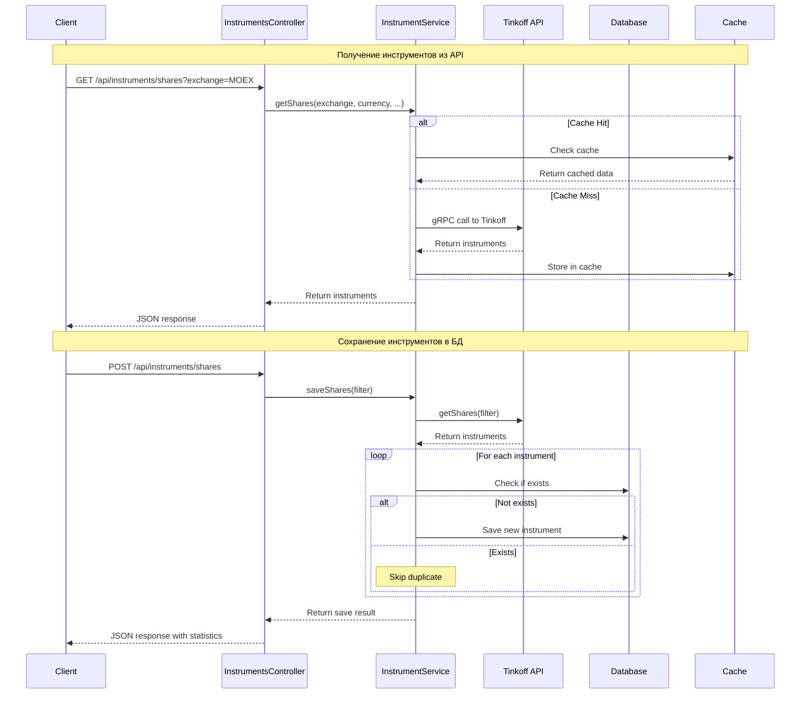
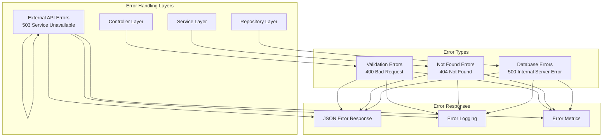
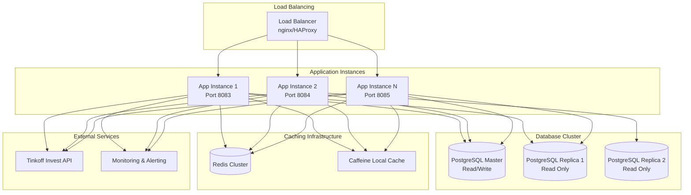
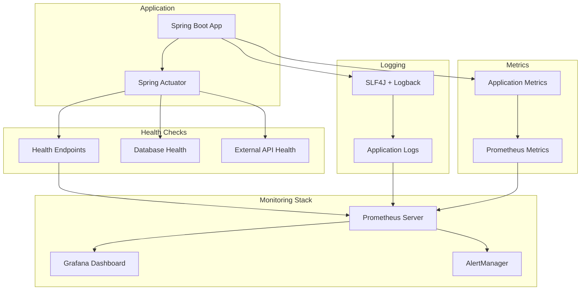
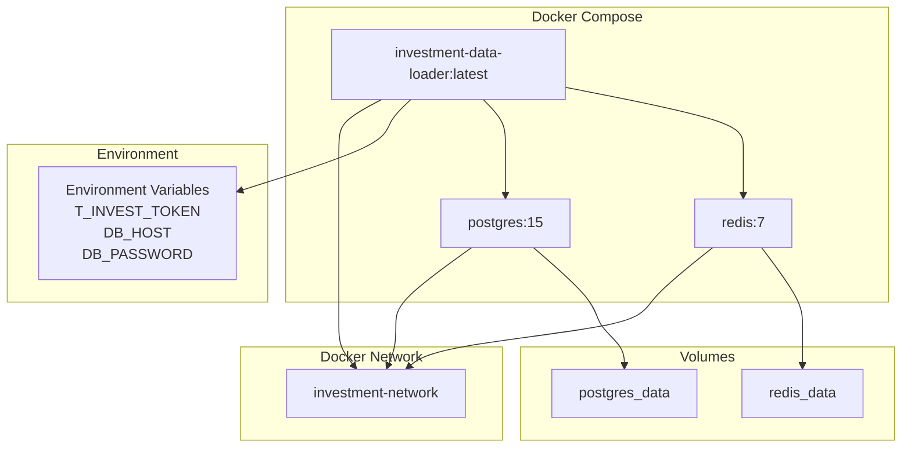

# Архитектура системы

## Высокоуровневая архитектура



## Детальная архитектура инструментов



## Поток данных для инструментов



## Архитектура кэширования

```mermaid
graph TB
  subgraph "Cache Layers"
    L1[L1: Caffeine Local Cache]
    L2[L2: Redis Distributed Cache]
  end
  
  subgraph "Cache Keys"
    SHARES[shares:status|exchange|currency|ticker|figi]
    FUTURES[futures:status|exchange|currency|ticker|assetType]
    INDICATIVES[indicatives:exchange|currency|ticker|figi]
  end
  
  subgraph "Cache TTL"
    TTL_SHORT[Short TTL: 5 minutes]
    TTL_MEDIUM[Medium TTL: 1 hour]
    TTL_LONG[Long TTL: 24 hours]
  end
  
  L1 --> SHARES
  L1 --> FUTURES
  L1 --> INDICATIVES
  
  L2 --> SHARES
  L2 --> FUTURES
  L2 --> INDICATIVES
  
  SHARES --> TTL_MEDIUM
  FUTURES --> TTL_MEDIUM
  INDICATIVES --> TTL_LONG
```

## Система обработки ошибок



## Масштабируемость



## Мониторинг и логирование



## Развертывание в Docker

