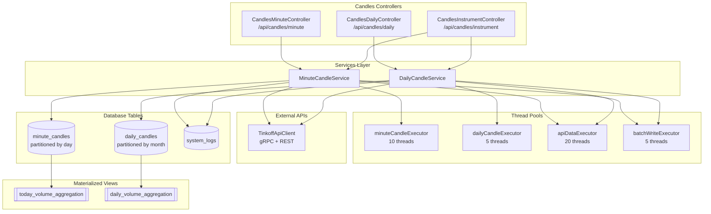
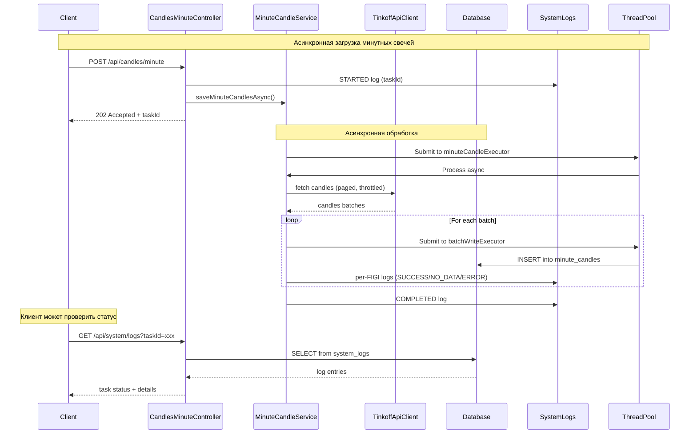
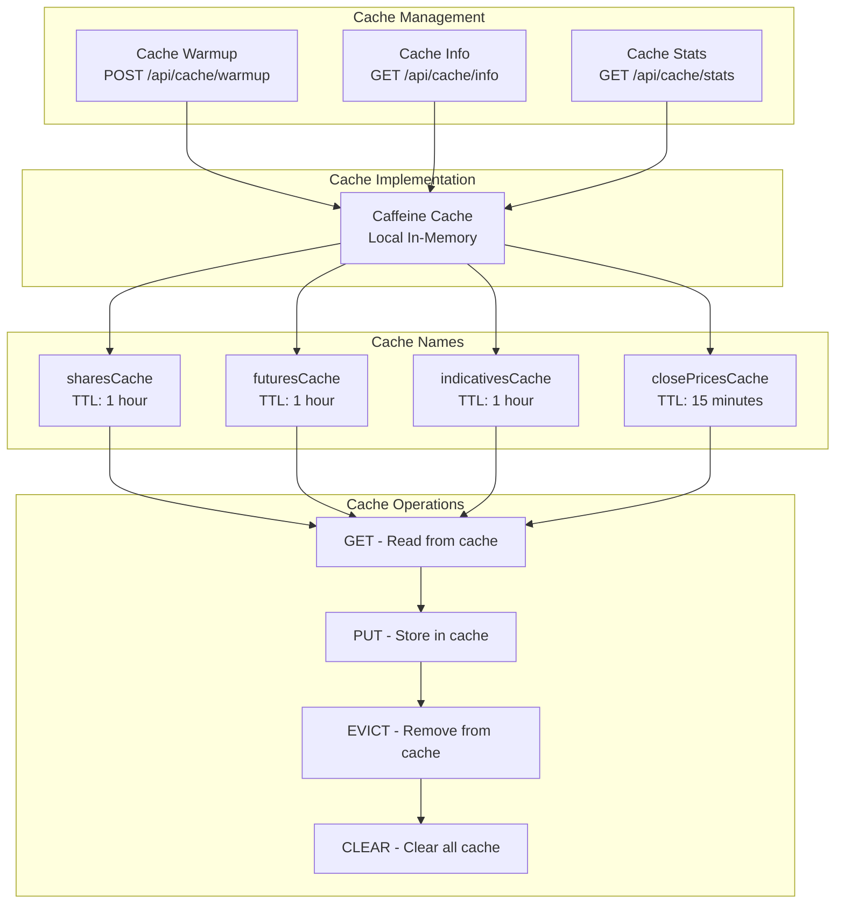
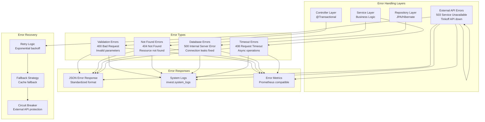
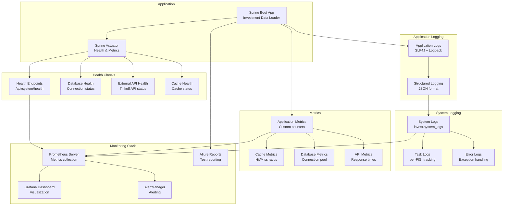
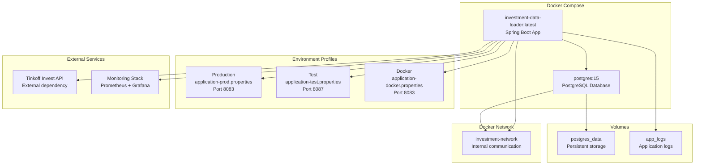

# Архитектура системы

## 🏗️ Высокоуровневая архитектура

```mermaid
flowchart TB
  subgraph Client[Клиенты]
    Web[Веб-интерфейс]
    Mobile[Мобильное приложение]
    API_Client[API клиенты]
    Postman[Postman/Insomnia]
  end

  subgraph Service[Investment Data Loader Service]
    subgraph Controllers[REST Controllers - 12 шт.]
      IC[InstrumentsController<br/>/api/instruments]
      CM[CandlesMinuteController<br/>/api/candles/minute]
      CD[CandlesDailyController<br/>/api/candles/daily]
      CI[CandlesInstrumentController<br/>/api/candles/instrument]
      MSP[MainSessionPricesController<br/>/api/main-session-prices]
      ESP[EveningSessionController<br/>/api/evening-session-prices]
      MSC[MorningSessionController<br/>/api/morning-session-prices]
      LT[LastTradesController<br/>/api/last-trades]
      TC[TradingController<br/>/api/trading]
      CC[CacheController<br/>/api/cache]
      VA[VolumeAggregationController<br/>/api/aggregation]
      SC[SystemController<br/>/api/system]
    end
    
    subgraph Services[Business Services - 9 шт.]
      IS[InstrumentService]
      MS[MinuteCandleService]
      DS[DailyCandleService]
      MDS[MainSessionPriceService]
      ESS[EveningSessionService]
      MSS[MorningSessionService]
      LTS[LastTradesService]
      TS[TradingService]
      CWS[CacheWarmupService]
    end
    
    subgraph Repositories[Data Layer - 13 шт.]
      SR[ShareRepository]
      FR[FutureRepository]
      IR[IndicativeRepository]
      MCR[MinuteCandleRepository]
      DCR[DailyCandleRepository]
      CPR[ClosePriceRepository]
      OPR[OpenPriceRepository]
      LPR[LastPriceRepository]
      SLR[SystemLogRepository]
    end
    
    subgraph External[External Clients]
      GRPC[Tinkoff gRPC Client]
      REST[Tinkoff REST Client]
      TAPI[TinkoffApiClient]
    end
    
    subgraph ThreadPools[Thread Pools]
      MCE[minuteCandleExecutor<br/>10 threads]
      DCE[dailyCandleExecutor<br/>5 threads]
      ADE[apiDataExecutor<br/>20 threads]
      BWE[batchWriteExecutor<br/>5 threads]
    end
    
    Cache[(Spring Cache<br/>Caffeine)]
    Scheduler[Schedulers<br/>7 планировщиков]
  end

  subgraph Database[PostgreSQL Database]
    subgraph Tables[Tables - 10+ шт.]
      S_TBL[(shares)]
      F_TBL[(futures)]
      I_TBL[(indicatives)]
      MC_TBL[(minute_candles)]
      DC_TBL[(daily_candles)]
      CP_TBL[(close_prices)]
      OPE_TBL[(close_prices_evening_session)]
      OP_TBL[(open_prices)]
      LP_TBL[(last_prices)]
      SL_TBL[(system_logs)]
    end
    
    subgraph Views[Materialized Views]
      MV_TODAY[[today_volume_aggregation]]
      MV_DAILY[[daily_volume_aggregation]]
    end
    
    subgraph Functions[Functions & Triggers]
      FUNC[PL/pgSQL Functions]
      TRIG[Database Triggers]
    end
  end

  subgraph External_APIs[Внешние API]
    TINKOFF[Tinkoff Invest API<br/>gRPC + REST]
  end

  %% Client connections
  Web --> IC
  Mobile --> IC
  API_Client --> IC
  Postman --> IC
  Web --> CM
  Mobile --> CM
  API_Client --> CM
  Postman --> CM

  %% Controller to Service
  IC --> IS
  CM --> MS
  CD --> DS
  CI --> MS
  CI --> DS
  MSP --> MDS
  ESP --> ESS
  MSC --> MSS
  LT --> LTS
  TC --> TS
  CC --> CWS
  VA --> MDS

  %% Service to Repository
  IS --> SR
  IS --> FR
  IS --> IR
  MS --> MCR
  DS --> DCR
  MDS --> CPR
  ESS --> OPE_TBL
  MSS --> OP_TBL
  LTS --> LPR

  %% Service to External
  IS --> GRPC
  IS --> REST
  MS --> TAPI
  DS --> TAPI
  LTS --> TAPI
  TS --> GRPC

  %% Repository to Database
  SR --> S_TBL
  FR --> F_TBL
  IR --> I_TBL
  MCR --> MC_TBL
  DCR --> DC_TBL
  CPR --> CP_TBL
  LPR --> LP_TBL
  SLR --> SL_TBL

  %% External to APIs
  GRPC --> TINKOFF
  REST --> TINKOFF
  TAPI --> TINKOFF

  %% Caching
  IS --> Cache
  CWS --> Cache

  %% Thread Pools
  MS --> MCE
  DS --> DCE
  MS --> ADE
  DS --> ADE
  MS --> BWE
  DS --> BWE

  %% Scheduling
  Scheduler --> IS
  Scheduler --> MS
  Scheduler --> DS
  Scheduler --> MDS
```



## 🔧 Детальная архитектура свечей



## 🔄 Поток данных для свечей



## 💾 Архитектура кэширования



## ⚠️ Система обработки ошибок



## 📈 Масштабируемость

```mermaid
graph TB
  subgraph "Load Balancing"
    LB[Load Balancer<br/>nginx/HAProxy]
  end
  
  subgraph "Application Instances"
    APP1[App Instance 1<br/>Port 8083 (PROD)]
    APP2[App Instance 2<br/>Port 8087 (TEST)]
    APP3[App Instance N<br/>Port 8088 (DEV)]
  end
  
  subgraph "Database Cluster"
    MASTER[(PostgreSQL Master<br/>Read/Write<br/>Partitioned Tables)]
    REPLICA1[(PostgreSQL Replica 1<br/>Read Only<br/>Analytics)]
    REPLICA2[(PostgreSQL Replica 2<br/>Read Only<br/>Reporting)]
  end
  
  subgraph "Caching Infrastructure"
    CAFFEINE[Caffeine Local Cache<br/>Per Instance]
    CACHE_MANAGER[Cache Manager<br/>Spring Cache]
  end
  
  subgraph "Thread Pools"
    TP1[minuteCandleExecutor<br/>10 threads per instance]
    TP2[dailyCandleExecutor<br/>5 threads per instance]
    TP3[apiDataExecutor<br/>20 threads per instance]
    TP4[batchWriteExecutor<br/>5 threads per instance]
  end
  
  subgraph "External Services"
    TINKOFF[Tinkoff Invest API<br/>Rate Limited]
    MONITORING[Monitoring & Alerting<br/>Prometheus + Grafana]
  end
  
  LB --> APP1
  LB --> APP2
  LB --> APP3
  
  APP1 --> MASTER
  APP1 --> REPLICA1
  APP2 --> MASTER
  APP2 --> REPLICA2
  APP3 --> MASTER
  APP3 --> REPLICA1
  
  APP1 --> CAFFEINE
  APP2 --> CAFFEINE
  APP3 --> CAFFEINE
  
  APP1 --> CACHE_MANAGER
  APP2 --> CACHE_MANAGER
  APP3 --> CACHE_MANAGER
  
  APP1 --> TP1
  APP1 --> TP2
  APP1 --> TP3
  APP1 --> TP4
  
  APP1 --> TINKOFF
  APP2 --> TINKOFF
  APP3 --> TINKOFF
  
  APP1 --> MONITORING
  APP2 --> MONITORING
  APP3 --> MONITORING
```

## 📊 Мониторинг и логирование



## 🐳 Развертывание в Docker

