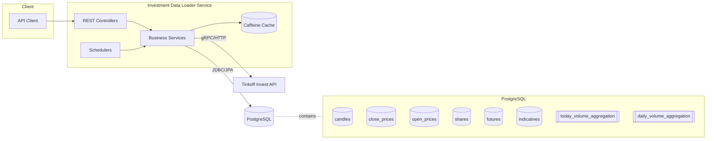

# Архитектура (высокоуровневая)

```mermaid
flowchart LR
  subgraph Client
    Postman[API Client]
  end

  subgraph Service[Investment Data Loader Service]
    Controllers[REST Controllers]
    Services[Business Services]
    Scheduler[Schedulers]
    Cache[(Caffeine Cache)]
  end

  Postman --> Controllers
  Controllers --> Services
  Scheduler --> Services
  Services -->|JDBC/JPA| DB[(PostgreSQL)]
  Services -->|gRPC/HTTP| Tinkoff[Tinkoff Invest API]
  Services --> Cache

  subgraph DBDetails[PostgreSQL]
    Candles[(candles)]
    Close[(close_prices)]
    Open[(open_prices)]
    Shares[(shares)]
    Futures[(futures)]
    Indicatives[(indicatives)]
    MvToday[[today_volume_aggregation]]
    MvDaily[[daily_volume_aggregation]]
  end

  DB -. contains .- DBDetails
```
