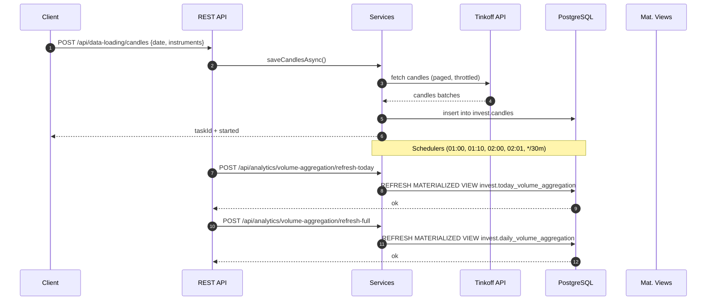

# Поток данных (ingestion & aggregation)

```mermaid
sequenceDiagram
  autonumber
  participant Client as Client
  participant API as REST API
  participant Svc as Services
  participant T as Tinkoff API
  participant DB as PostgreSQL
  participant MV as Mat. Views

  Client->>API: POST /api/data-loading/candles {date, instruments}
  API->>Svc: saveCandlesAsync()
  Svc->>T: fetch candles (paged, throttled)
  T-->>Svc: candles batches
  Svc->>DB: insert into invest.candles
  Svc-->>Client: taskId + started

  Note over Svc,DB: Schedulers (01:00, 01:10, 02:00, 02:01, */30m)

  API->>Svc: POST /api/analytics/volume-aggregation/refresh-today
  Svc->>DB: REFRESH MATERIALIZED VIEW invest.today_volume_aggregation
  DB-->>API: ok

  API->>Svc: POST /api/analytics/volume-aggregation/refresh-full
  Svc->>DB: REFRESH MATERIALIZED VIEW invest.daily_volume_aggregation
  DB-->>API: ok
```
