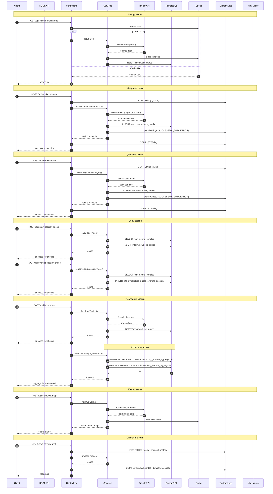
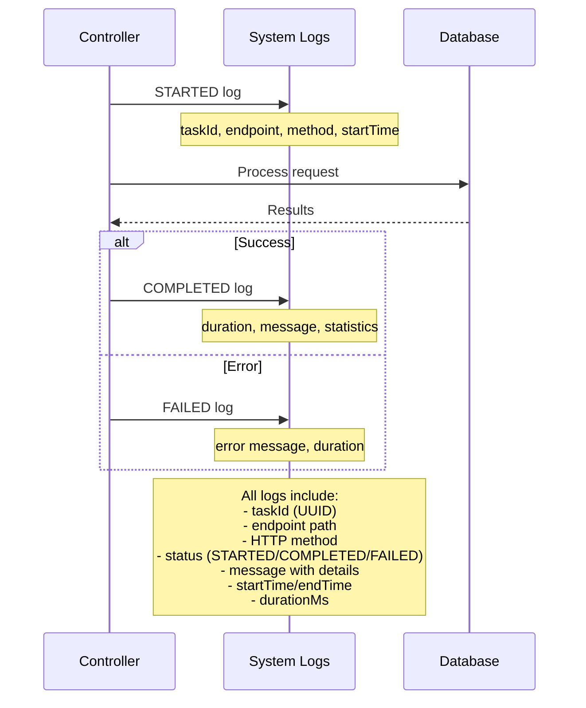
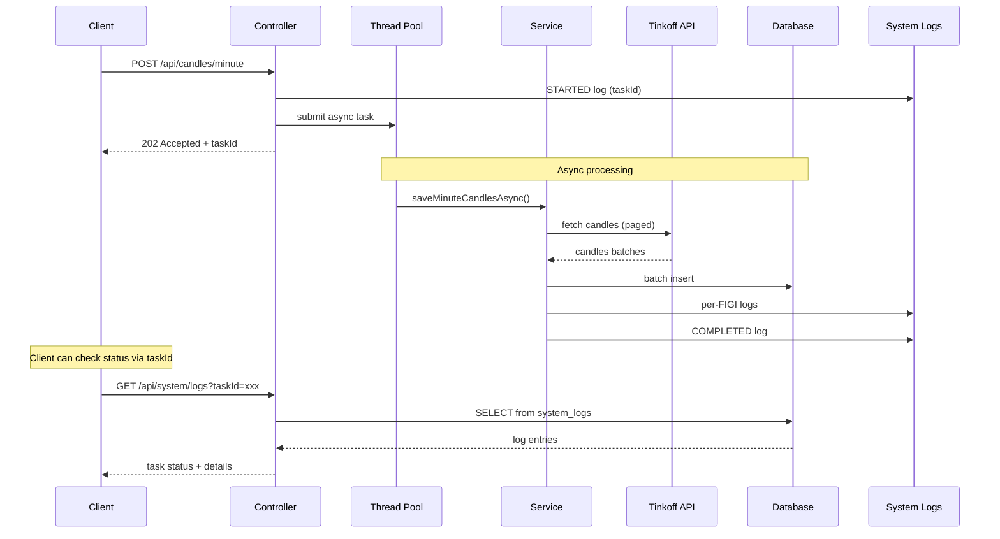
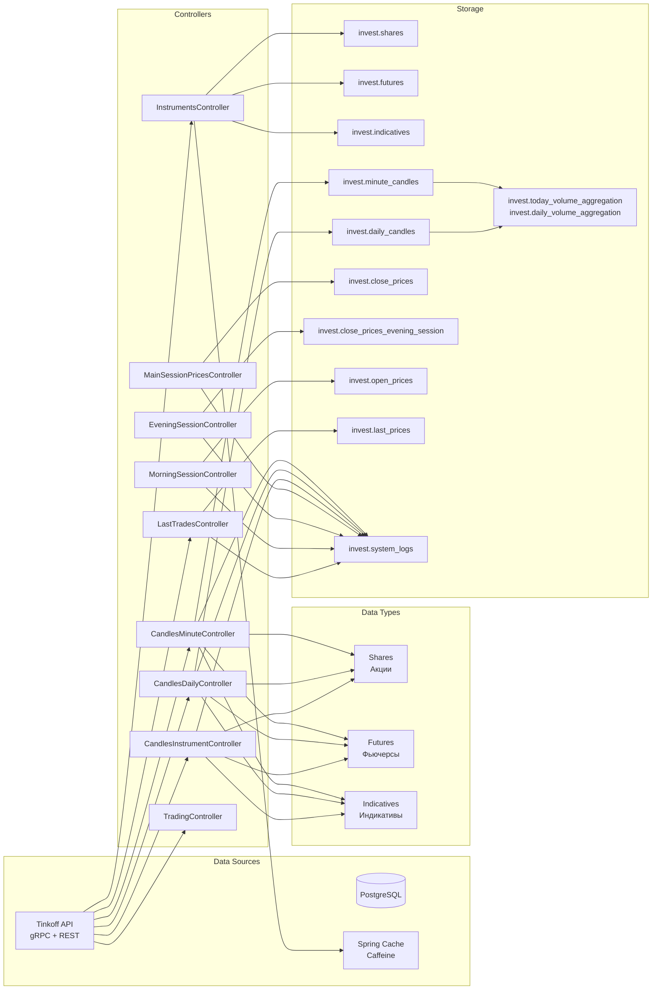
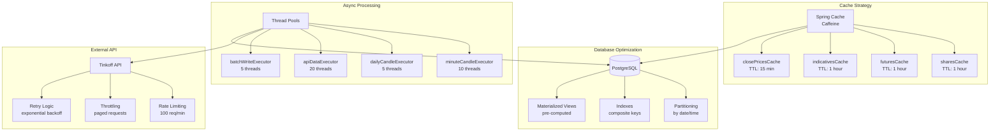

# Поток данных (ingestion & aggregation)

## 🔄 Основной поток данных

## 🏗️ Архитектура контроллеров

```mermaid
graph TB
    subgraph "API Controllers"
        IC[InstrumentsController<br/>/api/instruments]
        CM[CandlesMinuteController<br/>/api/candles/minute]
        CD[CandlesDailyController<br/>/api/candles/daily]
        CI[CandlesInstrumentController<br/>/api/candles/instrument]
        MSP[MainSessionPricesController<br/>/api/main-session-prices]
        ESP[EveningSessionController<br/>/api/evening-session-prices]
        MSC[MorningSessionController<br/>/api/morning-session-prices]
        LT[LastTradesController<br/>/api/last-trades]
        TC[TradingController<br/>/api/trading]
        CC[CacheController<br/>/api/cache]
        VA[VolumeAggregationController<br/>/api/aggregation]
        SC[SystemController<br/>/api/system]
    end
    
    subgraph "Services"
        IS[InstrumentService]
        MS[MinuteCandleService]
        DS[DailyCandleService]
        MDS[MainSessionPriceService]
        ESS[EveningSessionService]
        MSS[MorningSessionService]
        LTS[LastTradesService]
        TS[TradingService]
        CWS[CacheWarmupService]
    end
    
    subgraph "External APIs"
        TAPI[Tinkoff API<br/>gRPC + REST]
    end
    
    subgraph "Database"
        SH[invest.shares]
        FU[invest.futures]
        IND[invest.indicatives]
        MC[invest.minute_candles]
        DC[invest.daily_candles]
        CP[invest.close_prices]
        OPE[invest.close_prices_evening_session]
        OP[invest.open_prices]
        LP[invest.last_prices]
        SL[invest.system_logs]
        MV1[invest.today_volume_aggregation]
        MV2[invest.daily_volume_aggregation]
    end
    
    subgraph "Cache"
        CACHE[Spring Cache<br/>Caffeine]
    end
    
    IC --> IS
    CM --> MS
    CD --> DS
    CI --> MS
    CI --> DS
    MSP --> MDS
    ESP --> ESS
    MSC --> MSS
    LT --> LTS
    TC --> TS
    CC --> CWS
    VA --> MDS
    
    IS --> TAPI
    IS --> CACHE
    IS --> SH
    IS --> FU
    IS --> IND
    
    MS --> TAPI
    MS --> MC
    MS --> SL
    DS --> TAPI
    DS --> DC
    DS --> SL
    
    MDS --> MC
    MDS --> CP
    ESS --> MC
    ESS --> OPE
    MSS --> MC
    MSS --> OP
    LTS --> TAPI
    LTS --> LP
    TS --> TAPI
    
    CWS --> CACHE
    CWS --> TAPI
    
    CM --> SL
    CD --> SL
    CI --> SL
    MSP --> SL
    ESP --> SL
    MSC --> SL
    LT --> SL
```

## 📊 Система логирования

## 🔄 Асинхронная обработка

## 📈 Поток данных по типам инструментов

## 🔄 Кэширование и производительность

