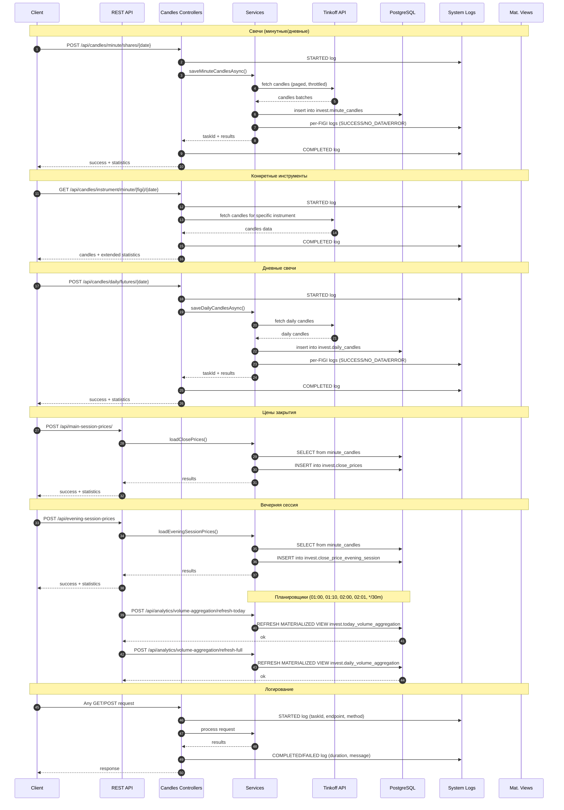
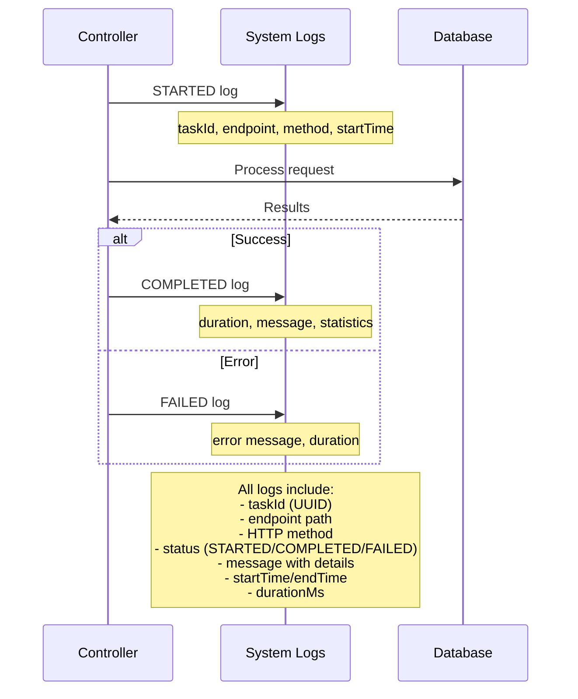
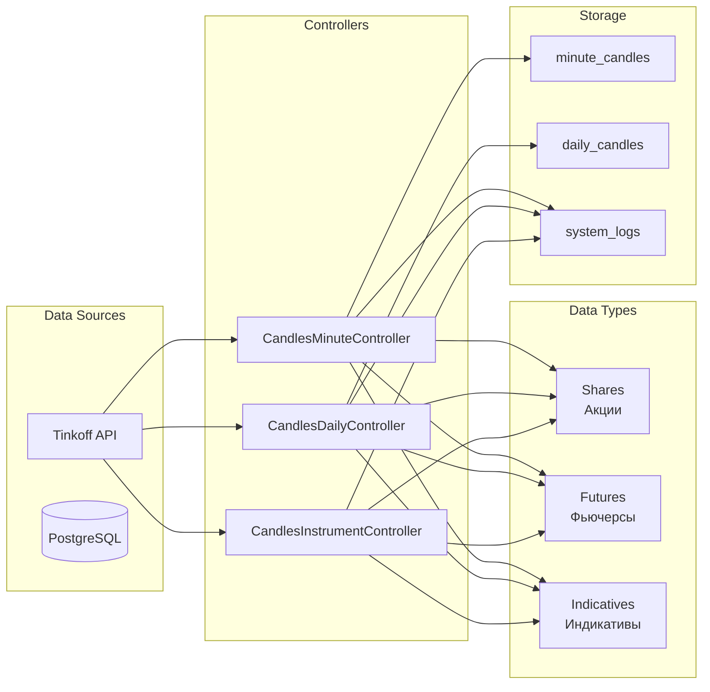

# Поток данных (ingestion & aggregation)



## Архитектура контроллеров свечей

```mermaid
graph TB
    subgraph "Candles Controllers"
        CM[CandlesMinuteController<br/>/api/candles/minute]
        CD[CandlesDailyController<br/>/api/candles/daily]
        CI[CandlesInstrumentController<br/>/api/candles/instrument]
    end
    
    subgraph "Endpoints"
        CM --> CM1[POST /minute]
        CM --> CM2[POST /minute/{date}]
        CM --> CM3[GET/POST /shares/{date}]
        CM --> CM4[GET/POST /futures/{date}]
        CM --> CM5[GET/POST /indicatives/{date}]
        
        CD --> CD1[POST /daily]
        CD --> CD2[POST /daily/{date}]
        CD --> CD3[GET/POST /shares/{date}]
        CD --> CD4[GET/POST /futures/{date}]
        CD --> CD5[GET/POST /indicatives/{date}]
        
        CI --> CI1[GET/POST /minute/{figi}/{date}]
        CI --> CI2[GET/POST /daily/{figi}/{date}]
    end
    
    subgraph "Services"
        MS[MinuteCandleService]
        DS[DailyCandleService]
        MDS[MarketDataService]
    end
    
    subgraph "Database"
        MC[invest.minute_candles]
        DC[invest.daily_candles]
        SL[invest.system_logs]
    end
    
    CM --> MS
    CD --> DS
    CI --> MS
    CI --> DS
    MS --> MDS
    DS --> MDS
    MS --> MC
    DS --> DC
    CM --> SL
    CD --> SL
    CI --> SL
```

## Система логирования



## Поток данных по типам инструментов

